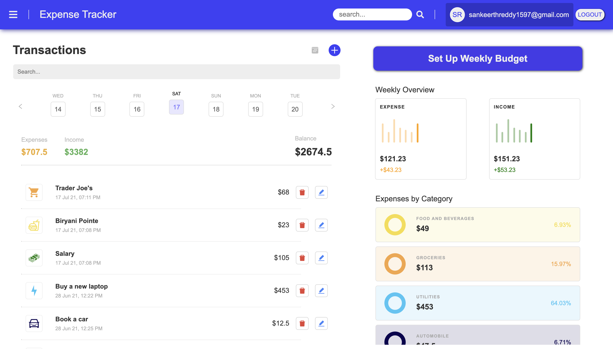

# Expense Tracker

- This is a full stack (MERN) expense tracker app which has login and singup authentication implemented with jwt tokens. Forgotpassword and resetpassword with token generation has also been implemented. After login the user will have details about his account like email and username and will be able to log transactions like income and expenditure and have basic details of how much money has been spent and how much income came in in a time period(weekly overview).

- Current work

  - Testing for bugs and server side API call bugs.
  - Multi user API calls are delayed after logout and login (working on improving the solution for this).

- This is a snapshot of the UI that has been implemented.

# Getting Started

- To run this project, clone it
  - run - _npm install_
  - This will install all the dependencies for the server side.
- Then cd into client using - _cd client_
  - run - _npm install_
  - This will install all the dependencies for the client side.
- Additionally you must create a config.env file with all the details like PORT, MONGO_URL, EMAIL services etc.
- Feel free to clone this project and give it a star if you found it helpful.
